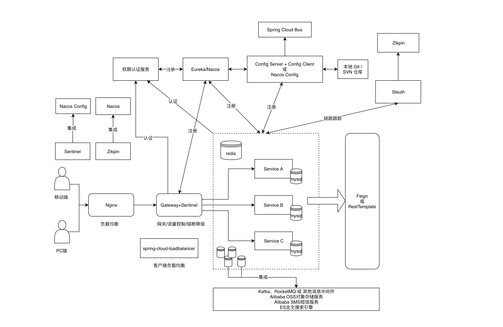

# Spring Cloud Example
此项目包含开发分布式应用微服务的必需组件，方便通过 Spring Cloud 架构模型使用支持Spring Cloud组件来开发分布式应用服务。

## 主要功能

* **服务限流降级**：支持 Feign、RestTemplate、Spring Cloud Gateway 等或其他支持 限流降级功能的接入，支持在运行时通过控制台实时修改限流降级规则。
* **服务注册与发现**：适配 Spring Cloud 服务注册与发现，此项目目前支持两种配置：Eureka和Nacos，两种取其中一种即可。
* **分布式配置管理**：支持分布式系统中的外部化配置，配置更改时自动刷新。目前项目支持可通过Nacos Config统一配置。
* **分布式事务**：我们折中选择由Alibaba团队开发的Seata分布式事务解决方案，目前项目集成支持Seata方案，使用 @GlobalTransactional 注解， 高效并且对业务零侵入地解决分布式事务问题。
* **安全加密支持**：项目支持对敏感数据不予暴露，采用不对称加密方式，支持对配置文件加密，提高项目的第一频道的安全性。
* **服务健康与监控**：用于管理和监控Spring Cloud的应用，提供简洁的可视化 WEB UI。
* **全链路监控**：是分布式监控系统，用于跟踪分布式服务之间的应用数据链路，分析处理延时，帮助我们改进系统的性能和定位故障。

## 组件

* **Oauth2 & Security**：基于OAUTH2.0统一认证授权的微服务基础架构，支持权限、角色等安全认证。

* **Sentinel**：监控服务，把流量作为切入点，从流量控制、熔断降级、系统负载保护等多个维度保护服务的稳定性。

* **Nacos**：提供用于存储配置和其他元数据的 key/value 存储，一个更易于构建云原生应用的动态服务发现、配置管理和服务管理平台。

* **Nacos Config**：Nacos Config是 Config Server 和 Client 的替代方案，项目很容易地使用 Nacos Config 来实现应用的外部化配置，实现统一配置与管理。

* **Eureka**：种基于REST的服务，主要用于定位服务，以实现中间层服务器的负载平衡和故障转移。目前还在跟随Spring Cloud版本升级维护，最终也会被替代。

* **Seata**：阿里巴巴开源产品，一个易于使用的高性能微服务分布式事务解决方案。

* **Gateway**：Spring Cloud Gateway是Spring Cloud官方推出的第二代网关框架，取代Zuul网关。网关作为流量的，在微服务系统中有着非常作用，网关常见的功能有路由转发、权限校验、限流控制等作用。

* **Zuul**：来于Netflix Zuul，目前还在继续维护，而Spring Cloud Gateway组件，不久将来逐渐淘汰。（目前不采用）

* **Jasypt**：提供对配置文件安全加密和管理。

* **Sleuth & Zikpin**：提供全链路监控，跟踪分布式服务间的应用数据链路。（未支持）

* **Apache Skywalking**：提供全链路监控，跟踪分布式服务间的应用数据链路。（已支持）

### 组织结构

    spring-cloud
    ├── example-api -- openFeign相关接口api
    ├── example-auth-server -- 认证系统
    ├── example-boot-admin -- 服务健康与监控系统
    ├── example-common -- 工具类及通用代
    ├── example-docs -- 项目文档信息
    ├── example-demo -- 相关框架实例
    ├── example-entity -- 数据层公共实体类
    ├── example-enums -- 枚举公共类
    ├── example-eureka -- Eureka服务注册与发现组件
    ├── example-gateway -- SpringCloud Gateway网关组件
    ├── example-gateway-zuul -- SpringCloud Zuul网关组件
    ├── example-generator -- Mybatis构建自动化
    ├── example-model -- 与前端交互视图实体相关，VO、DTO、BTO
    ├── example-parent-old -- 父POM
    ├── example-core -- 服务层公共配置信息和组件初始化代码
    ├── example-service -- 独立服务父POM
    ├────── example-business-service -- 独立业务服务1
    ├────── example-order-service -- 独立业务服务2
    ├────── example-storage-service -- 独立业务服务3
    ├────── example-user-service -- 独立业务服务4
    ├────── example-mybatis-service -- 独立业务服务5
    ├── example-skywalking-agent -- 提供全链路监控agent
    ├── example-test -- 框架搭建时的相关测试代码
    ├── example-turbine -- 聚合监控(Hystrix Turbine)
    ├── sql -- sql执行语句
    └── style -- 框架代码规范约定

## 版本说明
#### 版本依赖关系
技术 | 说明  | 官网
----|----|----
Spring Cloud | 微服务架构框架 | [https://spring.io/projects/spring-cloud](https://spring.io/projects/spring-cloud)
Spring Boot | SpringBoot框架 | [https://spring.io/projects/spring-boot](https://spring.io/projects/spring-boot)
Netflix Eureka | 服务注册与发现 | [https://github.com/Netflix/eureka](https://github.com/Netflix/eureka)
Alibaba Nacos | 服务注册与发现 | [https://github.com/alibaba/nacos](https://github.com/alibaba/nacos)
Nacos Config | 服务配置中心 | [https://github.com/alibaba/nacos](https://github.com/alibaba/nacos)
Netflix Eureka | 服务注册与发现 | [https://github.com/Netflix/eureka](https://github.com/Netflix/eureka)
Gateway | 服务网关 | [https://spring.io/projects/spring-cloud](https://spring.io/projects/spring-cloud)
Zull | 服务网关 | [https://spring.io/projects/spring-cloud](https://spring.io/projects/spring-cloud)
Spring Security | 认证和授权框架 | [https://spring.io/projects/spring-security](https://spring.io/projects/spring-security)
Oauth2.0 | 认证授权协议规范 | [https://oauth.net/2](https://oauth.net/2)
OpenFeign | 服务之间调用解决方案 | [https://github.com/OpenFeign/feign](https://github.com/OpenFeign/feign)
Alibaba Sentinel | 流量控制、熔断降级 | [https://github.com/alibaba/Sentinel](https://github.com/alibaba/Sentinel)
Alibaba Seata | 分布式事务框架 | [https://github.com/seata/seata](https://github.com/seata/seata)
Apache Skywalking | 提供全链路监控 | [https://github.com/apache/skywalking](https://github.com/apache/skywalking)
Jasypt | 安全加密和管理 | [https://github.com/ulisesbocchio/jasypt-spring-boot](https://github.com/ulisesbocchio/jasypt-spring-boot)
MyBatis | ORM框架 | [http://www.mybatis.org/mybatis-3/zh/index.html](http://www.mybatis.org/mybatis-3/zh/index.html)
MyBatis | ORM增强工具 | [https://mp.baomidou.com/](https://mp.baomidou.com/)
MyBatisGenerator | 数据层代码生成 | [http://www.mybatis.org/generator/index.html](http://www.mybatis.org/generator/index.html)
PageHelper | MyBatis物理分页插件 | [http://git.oschina.net/free/Mybatis_PageHelper](http://git.oschina.net/free/Mybatis_PageHelper)
Swagger-UI | 文档生产工具 | [https://github.com/swagger-api/swagger-ui](https://github.com/swagger-api/swagger-ui)
Redis | 分布式缓存 |[https://redis.io/](https://redis.io/)
Druid | 数据库连接池 |[https://github.com/alibaba/druid](https://github.com/alibaba/druid)
JWT | JWT登录支持 | [https://github.com/auth0/java-jwt](https://github.com/auth0/java-jwt)
logback | 日志收集 | [https://github.com/logstash/logstash-logback-encoder](https://github.com/logstash/logstash-logback-encoder)
Lombok | 简化对象封装工具 | [https://github.com/rzwitserloot/lombok](https://github.com/rzwitserloot/lombok)

## 架构图

##### 系统架构图

##### 业务架构图
TDB

## 如何构建

* 项目采用 Spring Cloud Greenwich，最低支持 JDK 1.8。
* Maven：3.3.9+
* Mysql：5.7+
* Redis：3.2+

Spring Cloud 使用 Maven 来构建，最快的使用方式将本项目执行以下命令：

	./mvnw clean install

执行完毕后，项目将被安装到本地 Maven 仓库。

## 运行

启动各服务即可，访问各服务查看对应的配置文件，格式：

    spring.application.name:spring.port

参考文档 查看 [WIKI](https://github.com/romeoblog/spring-cloud/blob/master/example-docs/src/main/asciidoc-zh/document.adoc) 

## 个人微信

## 许可证

[Apache License 2.0](https://github.com/romeoblog/spring-cloud/blob/master/LICENSE)

Copyright 2019 https://github.com/romeoblog/spring-cloud.git Group.